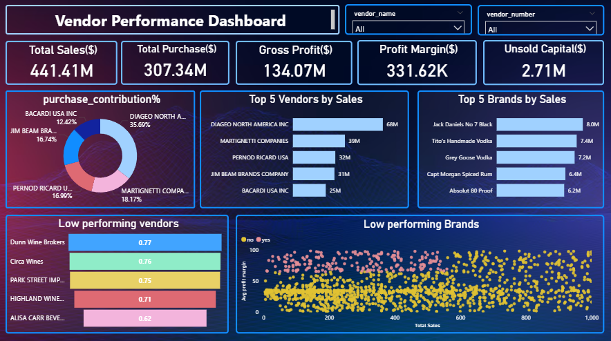

#  Vendor Sales Analysis

> A comprehensive analysis of inventory, sales, and vendor performance to optimize profitability in the retail and wholesale industry.

---

##  Table of Contents

- [Project Structure](#project-structure)
- [Requirements](#requirements)
- [Dataset](#Dataset)
- [Dataset link](#Dataset-link)
- [Tools & technologies](#tools-and-technologies)
- [How to Run](#how-to-run)
- [Business Problem](#business-problem)
- [Exploratory Data Analysis](#exploratory-data-analysis)
- [Research Questions & Key Findings](#research-questions--key-findings)
- [Recommendations](#recommendations)
- [Author](#Author)

---

## Project Structure

```
vendor-performance-analysis/
│
├── data/
│   └── inventory.db
│
├── notebooks/
│   ├── exploratory_data_analysis.ipynb
│   └── vendor_performance_analysis.ipynb
│
├── scripts/
│   ├── ingestion_db.py
│   └── get_vendor_summary.py
│
├── dashboard/
│   └── vendor_performance_dashboard.pbix
│
├── README.md
├── vendor_performance_report.pdf
└── .gitignore
```

---

## Requirements

Make sure you have **Python 3.8+** installed. Then install the required libraries:

```bash
pip install pandas numpy matplotlib seaborn scipy jupyter
```

Or if you use a `requirements.txt`:

```bash
pip install -r requirements.txt
```

**Full list of dependencies:**

| Library | Purpose |
|---|---|
| `pandas` | Data loading & manipulation |
| `numpy` | Numerical computations |
| `matplotlib` | Plotting & visualizations |
| `seaborn` | Statistical visualizations |
| `sqlite3` | Database connection (built-in) |
| `jupyter` | Running `.ipynb` notebooks |

---
### Dataset
- `purchases_prices`
- `sales`
- `begin_inventory`
- `vendor_invoice`
- `end_inventory`
- `purchases`

### Dataset link
https://www.youtube.com/redirect?event=video_description&redir_token=QUFFLUhqbU1SdmViclEtM19mSkJ6OEtsMENPc2JZclpTd3xBQ3Jtc0trLXh3NllSUXp2eVYyTnFCX05aaFhoQVRlMkhYU296X3pGMFJTVGZtdUFBQlk2bGR5ZHRPTmxEZG9QYjVQYUdQNjRNMGtmNERzU25LeVZGdGxJR1NmS19mZGhYY3hEVXlQOVdaRFdBU3Z1aUZUYTZaOA&q=https%3A%2F%2Ftopmate.io%2Fayushi_mishra%2F1557424&v=nmCfNHjfgEY

### Tools and technologies 
- SQL
- pyhon
- power BI

## How to Run

### 1. Clone the Repository

```bash
git clone https://github.com/your-username/vendor-performance-analysis.git
cd vendor-performance-analysis
```

### 2. Add the Database

Place your `inventory.db` SQLite file inside the project root (same directory as the notebooks). The database should contain the following tables:

- `purchases_prices`
- `sales`
- `begin_inventory`
- `vendor_invoice`
- `purchases`
- `end_inventory`

### 3. Launch Jupyter Notebook

```bash
jupyter notebook
```

### 4. Run the Notebooks (in order)

| Step | Notebook | Description |
|---|---|---|
| 1️⃣ | `exploratory_data_analysis.ipynb` | Connect to DB, explore raw tables, check data quality |
| 2️⃣ | `vendor_performance_analysis.ipynb` | Filter data, run analysis, generate all charts & findings |

Open each notebook and run all cells using:
- **Menu:** `Kernel → Restart & Run All`
- **Shortcut:** `Shift + Enter` to run cell by cell

>  **Note:** Both notebooks connect to `inventory.db` via `sqlite3.connect('inventory.db')`. Make sure the database file is in the **same directory** as the notebooks before running.

---

## Business Problem

Effective inventory and sales management are critical for optimizing profitability in the retail and wholesale industry. Companies need to ensure they are not incurring losses due to inefficient pricing, poor inventory turnover, or vendor dependency.

**The goals of this analysis are to:**

-  Identify underperforming brands that require promotional or pricing adjustments.
-  Determine top vendors contributing to sales and gross profit.
-  Understand the impact of bulk purchasing on unit costs.

---

## Exploratory Data Analysis

### Summary Statistics

The dataset contains **10,692 records** across key metrics including vendor numbers, brands, purchase/actual prices, volume, sales quantities, freight costs, gross profit, and profit margins.

**Key observations from the summary:**

| Metric | Notable Insight |
|---|---|
| `gross_profit` | Min value is negative — losses exist |
| `profit_margin` | Min of `-inf` — some transactions have zero revenue |
| `total_sales_quantity` | Min of `0` — some inventory was never sold |
| `stock_turnover` | Ranges from `0` to `274.5` — extreme variation in sell-through |
| `freight_cost` | Very high std deviation — logistics inefficiencies suspected |

---

### Negative & Zero Values

- **Gross Profit:** Minimum value below zero indicates some products are being sold at a loss — either due to high costs or discounts below purchase price.
- **Profit Margin:** A minimum of negative infinity suggests cases where revenue is zero or lower than total costs.
- **Total Sales Quantity & Sales Dollars:** Minimum values of `0` confirm that certain products were purchased but **never sold**, pointing to slow-moving or obsolete stock.

---

### Outliers Indicated by High Standard Deviations

- **Purchase & Actual Prices:** Max values far exceed the mean, indicating the presence of **premium products** in the catalog.
- **Freight Cost:** Large variance suggests either **logistics inefficiencies** or the impact of bulk shipment size differences.
- **Stock Turnover:** A range of `0` to `274.5` implies some products sell extremely fast while others remain in stock indefinitely. Values above `1` indicate that sold quantities exceed purchased quantities — likely fulfilled from older stock.

---

### Data Filtering

To improve the reliability of insights, the following records were removed:

| Filter Condition | Reason |
|---|---|
| `gross_profit <= 0` | Exclude loss-making transactions |
| `profit_margin <= 0` | Focus on profitable transactions only |
| `total_sales_quantity = 0` | Remove inventory that was never sold |

---

### Correlation Insights

Key findings from the correlation heatmap:

- **Purchase price vs. sales/profit:** Weak correlation (`-0.01` and `-0.02`) — price variations alone do **not** significantly drive revenue or profit.
- **Purchase quantity vs. sales quantity:** Strong positive correlation — confirms **efficient inventory turnover** across the dataset.
- **Profit margin vs. sales price:** Negative correlation — as sales price increases, margins tend to decrease, likely due to **competitive pricing pressures**.
- **Stock turnover vs. profitability:** Weak negative correlation — faster inventory movement does **not** guarantee higher margins.

---

## Research Questions & Key Findings

- 1. Brands Needing Promotional or Pricing Adjustment
- 2. Top Vendors & Brands by Sales Performance
- 3. Vendor Contribution to Total Purchase Dollars
- 4. Procurement Dependency on Top Vendors
- 5. Bulk Purchasing & Unit Price Impact


**Key findings:**

- Bulk buyers (large order size) consistently achieve the **lowest unit prices**, enabling higher margins when inventory is managed efficiently.
- The price difference between small and large orders represents approximately a **~72% reduction in unit cost**.
- Bulk pricing strategies effectively encourage large-volume purchasing, driving higher overall sales even with lower per-unit revenue.

---

## Dashboard Preview



## Recommendations

Based on the analysis, the following strategic actions are recommended:
- Diversify Vendor Partnerships
- Leverage Bulk Purchasing
- Targeted Marketing for High-Margin, Low-Sales Brands
- Operational Efficiency

---


## Author
Jeba Perveen

